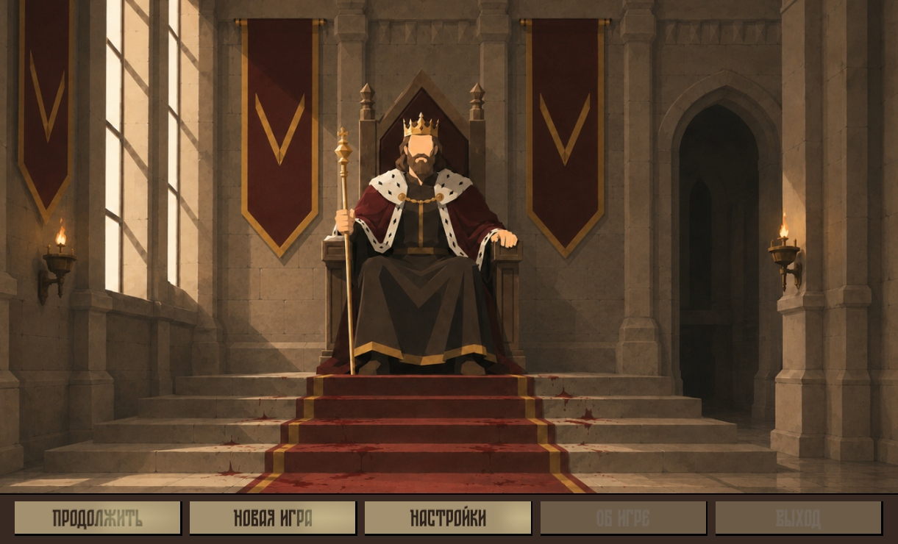
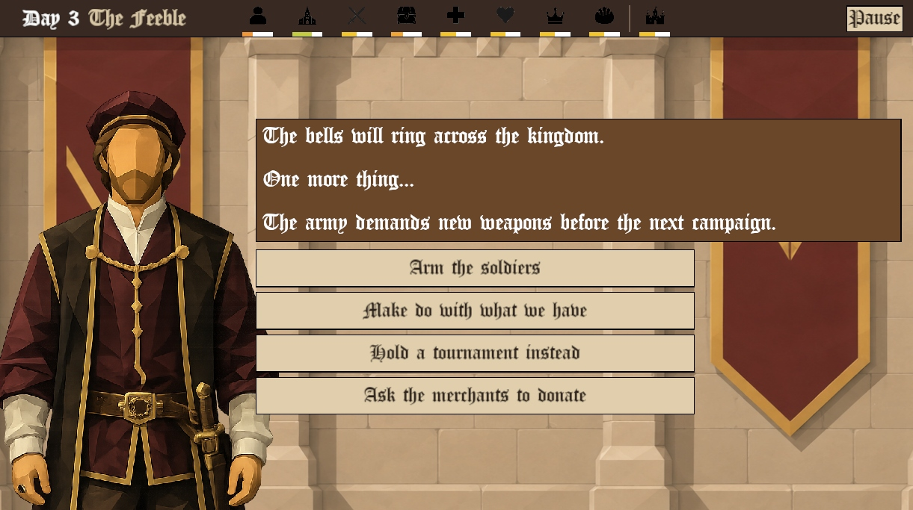
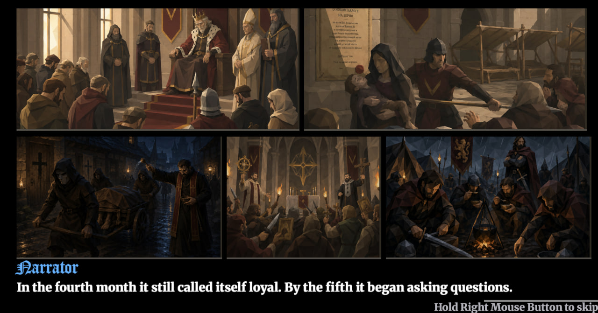
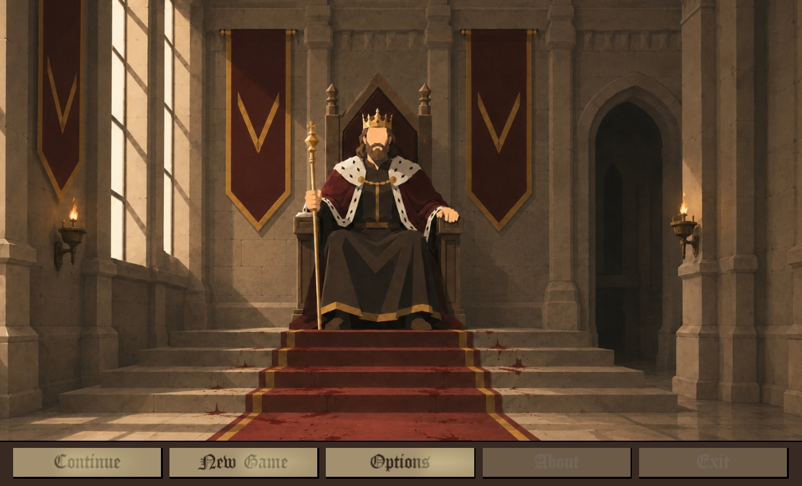

# The Weight of the Crown

You usurped Estedor's throne. Now balance factions, control the masses, and survive the crown's weight through 365 days of rule.

**[Play on itch.io →](https://marysue.itch.io/the-weight-of-the-crown)**

## About

King Edwin is dead. You — Gregor, the usurper — sit on the throne of Loria while the realm still bleeds from plague, empty granaries, unpaid soldiers, and a church that cannot decide whether your crown is holy or cursed. Every morning brings another petitioner, another crisis, another chance to buy peace at a price you cannot afford twice.

**What you'll do**

- **Rule day by day** — courtiers and commoners bring dilemmas only a monarch can answer
- **Balance nine living meters of power** — People, Church, Army, Treasury, Health, Loyalty, Nobility, Food, and Succession
- **Survive intertwined story arcs** — the old king's household, church tax wars, merchant guilds, plague cures, great-house feuds, and more
- **Use advisor actions** — spend scarce resources when you can afford them, and watch synergies reward coherent rule — or punish a crown pulled in every direction at once

**Features**

- Branching narrative with persistent story arcs and reactive dialogue
- Illustrated characters, voiced cutscenes, and unique death screens
- English and Russian localization
- Save and continue — chase your longest reign

## Screenshots

<table>
<tr>
<td width="50%">

<b>Main menu</b> — The throne awaits. Your reign begins with a coup already behind you and a kingdom already against you.

</td>
<td width="50%">

<b>Court dialogue</b> — Petitioners arrive with problems, flattery, and threats. Every answer shifts the realm.

</td>
</tr>
<tr>
<td width="50%">

<b>Cutscenes</b> — Illustrated story beats and voiced sequences mark the turning points of your rule.

</td>
<td width="50%">

<b>Kingdom management</b> — Watch your meters, unlock new powers, and decide which pillar of the realm you can afford to neglect.

</td>
</tr>
</table>

## EdenSpark Game Jam #2

This game was created for **[EdenSpark Game Jam #2](https://itch.io/jam/edenspark-game-jam-2)**, hosted by EdenSpark. The jam ran from June 1 to June 15, 2026. The theme was **Mass Control** — controlling crowds, balancing weight and pressure, or any metaphor your design could reach.

*The Weight of the Crown* takes that theme literally and politically: you seized a kingdom by force, and now you must control the masses, the factions, and the crushing weight of every choice that keeps you on the throne.

## Credits

| Role | Name |
| --- | --- |
| Game designer / programmer | Viktar Syanau (MarySue) |

## Development

Built with **[EdenSpark](https://edenspark.io)** using **Gen2 daScript** (Daslang).

**Requirements:** [EdenSpark Launcher](https://edenspark.io) with this project opened from the Eden projects folder.

**Open the project**

1. Install EdenSpark Launcher
2. Clone this repository into your Eden projects directory
3. Open the project from the launcher and press Play

Game logic lives in `.das` modules (`main.das`, story arcs, encounters, UI, and game state). Python scripts under `tools/` and `scripts/` support dialogue generation and content pipelines.

**Project ID:** `019eab54-61cf-7c88-a293-0fa895edb23b`
